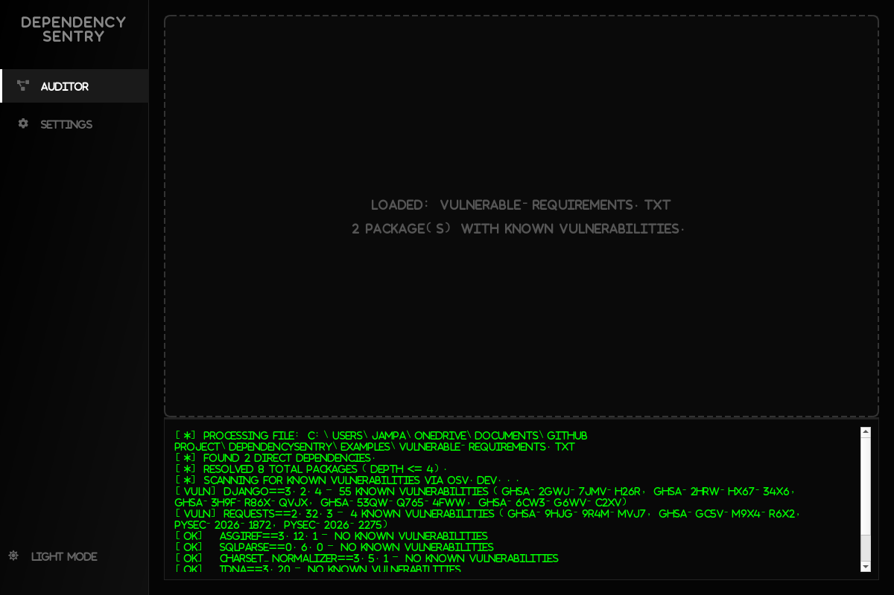

# Dependency-Sentry

A desktop SBOM auditor for Python projects: drag in a `requirements.txt`,
and it resolves the full dependency tree (not just direct dependencies)
and checks every package against the [OSV.dev](https://osv.dev) vulnerability
database.



## Features

- **Full dependency tree resolution.** Walks transitive dependencies via
  the PyPI JSON API, up to a configurable depth (`config.json`), not just
  the packages listed directly in your manifest.
- **Real vulnerability scanning.** Every resolved package (pinned version
  if specified, latest published version otherwise) is checked against
  OSV.dev's live vulnerability database.
- **Responsive UI.** The scan runs on a background thread so the window
  never freezes while making network calls, with live progress in the
  console.
- **Drag-and-drop.** Drop a `requirements.txt` onto the window or browse
  for one.

## Installation

```bash
git clone https://github.com/JampaniKomal/DependencySentry.git
cd DependencySentry
pip install -r requirements.txt
python main.py
```

## Usage

1. Drag a `requirements.txt` onto the window (or click to browse).
2. Watch the console as it resolves the dependency tree and queries
   OSV.dev for each package.
3. Any package with known vulnerabilities is flagged `[VULN]` with its
   advisory IDs; clean packages are flagged `[OK]`.

Try it against `examples/vulnerable-requirements.txt` — a manifest with
two deliberately outdated, genuinely vulnerable pins (`django==3.2.4`,
`requests==2.32.3`) — to see real findings immediately.

## Testing & Verification

The core scanning logic (`src/core/resolver.py`, `src/core/scanner.py`)
already worked and was verified against the real PyPI and OSV.dev APIs,
but was never actually wired into the running application — the GUI only
listed package names from the manifest and never resolved or scanned
anything. Fixed by adding `src/core/auditor.py`, a background-thread
worker that runs the real parse -> resolve -> scan pipeline and streams
results into the UI, and wiring it into `main_window.py` in place of the
old name-only listing.

Verified end to end (not just the individual modules) by driving the
actual `MainWindow` class headlessly with a manifest containing known-
vulnerable pins: confirmed the console correctly reports 55 real
vulnerabilities for `django==3.2.4` (including a CRITICAL SQL injection
advisory) and 4 for `requests==2.32.3`, that clean transitive
dependencies are correctly reported `[OK]`, and that the UI re-enables
itself after the scan completes rather than getting stuck.

Also found and fixed: `qtawesome` is imported by the UI but was missing
from `requirements.txt` entirely (a fresh install would crash on
launch); `requests` was pinned to a version with 2 known CVEs
(`PYSEC-2026-1872`, `PYSEC-2026-2275`), bumped to 2.33.0 and re-verified
clean with `pip-audit`.

## Known Limitations

- No dependency graph visualization yet — results are shown as a text
  log, not the visual tree the "AUDITOR" icon implies. Removed the
  previously-empty placeholder files for this (`graph_widget.py`,
  `details_panel.py`) rather than ship unused stubs.
- The "abandonware" check configured in `config.json`
  (`abandonware_threshold_days`) is not implemented — no code currently
  flags packages that haven't been updated recently.
- Version resolution for unpinned dependencies always uses the latest
  published version, not a real dependency-resolver-style constraint
  solve across the whole tree.
- The "SETTINGS" nav item in the sidebar has no page behind it yet.

## Future Roadmap

- [ ] Visual dependency graph (the originally-planned `graph_widget.py`).
- [ ] Abandonware detection using `abandonware_threshold_days`.
- [ ] A results/details panel instead of a plain scrolling console.

## License

MIT — see [LICENSE](LICENSE).
