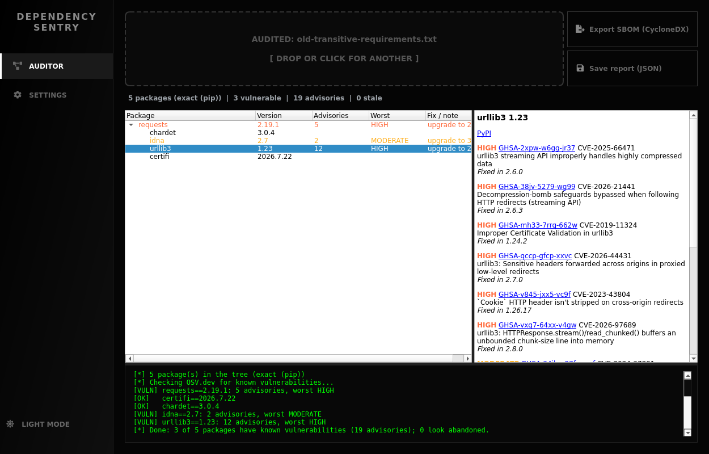

# Dependency-Sentry

[](https://github.com/JampaniKomal/DependencySentry/actions/workflows/ci.yml)

A desktop SBOM auditor for Python projects: drag in a `requirements.txt` or
`pyproject.toml`, and it works out the **full dependency tree at the exact
versions that would be installed**, checks every package against the
[OSV.dev](https://osv.dev) vulnerability database, flags packages that look
abandoned, and exports the result as a **CycloneDX SBOM**. A command-line
version does the same in CI.



## Why exact versions matter

Most vulnerabilities in a Python project are not in what it lists but in what
those packages pull in, at whatever version the installer picks. Take
`requests==2.19.1` ([examples/old-transitive-requirements.txt](examples/old-transitive-requirements.txt)):
it pins `urllib3<1.24` and `idna<2.8`, so an install gets urllib3 1.23 and
idna 2.7, both with known vulnerabilities, even though today's urllib3 and
idna are clean.

| | Version 1 | Version 2 |
|---|---|---|
| Versions of transitive packages | the latest release | what pip would install |
| Dependencies of `requests==2.19.1` | those of the *latest* requests (lists charset-normalizer, which 2.19.1 does not use) | those of 2.19.1 (chardet, idna, urllib3, certifi) |
| Vulnerable packages found | 1 (requests) | 3 (requests, urllib3 1.23, idna 2.7) |
| Advisories | missed all 14 for urllib3 and idna | 19, merged across PYSEC and GHSA, with severity and the version that fixes each |

## How it works

1. **Read the manifest.** Requirements files (comments, line continuations,
   `-r` includes, hashes, environment markers, extras) or the `[project]`
   dependencies of a `pyproject.toml`. Editable, local and URL requirements
   cannot be audited by name and version, so they are listed as skipped
   instead of silently dropped.
2. **Resolve exactly.** Dependency-Sentry asks pip's own resolver:
   `pip install --dry-run --report --only-binary=:all:` lists every package
   pip would install, at the version it would choose, for this Python and
   platform. Nothing is installed, and because only wheels are considered, no
   package's build code ever runs, which matters for a manifest you do not
   trust. Edges of the tree come from each package's own metadata, with
   environment markers and extras evaluated.
3. **Fall back honestly.** If pip cannot resolve (a package with no wheel, a
   conflict), Dependency-Sentry says so and resolves *approximately* from
   PyPI's metadata: the pinned version, or the newest non-yanked release that
   satisfies the specifier, and the dependencies of that exact version. The
   report and the SBOM record which mode was used.
4. **Check OSV.dev.** All packages go in one batched query; each advisory is
   then fetched once for its summary, aliases (CVE, GHSA, PYSEC), severity and
   fixed versions. Records that alias each other (a PYSEC entry and its GHSA
   twin) are merged into one, so a vulnerability is counted once.
5. **Flag abandonware.** Packages whose project has had no release for a set
   period (730 days by default) are marked stale.
6. **Report.** A dependency tree coloured by worst severity, per-package
   advisories with links and the lowest version that fixes each, a CycloneDX
   1.6 SBOM (components with purls, the dependency graph, and the
   vulnerabilities with ratings and upgrade recommendations), JSON, or text.

## Installation

```bash
git clone https://github.com/JampaniKomal/DependencySentry.git
cd DependencySentry
pip install -e .
dependency-sentry-gui                 # the desktop app (or: python main.py)
```

## Usage

### Desktop app
1. Drop a `requirements.txt` or `pyproject.toml` onto the window (or click to browse).
2. The tree shows every package under the one that pulls it in, coloured by
   its worst advisory; select a package for its advisories, CVEs and fixed versions.
3. **Export SBOM** writes CycloneDX JSON; **Save report** writes the audit as JSON.
4. **Settings**: exact or approximate resolution, and the abandonware period.

### Command line

```bash
dependency-sentry requirements.txt                          # text report, exit 1 if anything is vulnerable
dependency-sentry pyproject.toml --sbom sbom.cdx.json       # also write a CycloneDX SBOM
dependency-sentry requirements.txt --fail-on high --json    # gate CI on HIGH or CRITICAL only
```

Options: `--approximate`, `--abandoned-after DAYS` (0 = off), `--fail-on
none|any|low|moderate|high|critical`, `--quiet`. Exit code 0 means nothing at
or above `--fail-on`, 1 means something was found, 2 means the manifest could
not be read.

## Tests and CI

15 tests run offline, with PyPI and OSV.dev faked: manifest parsing, the
graph built from a recorded pip report, approximate resolution (specifiers,
pre-releases, yanked releases, markers, extras), OSV alias merging and
severities, fixed-version selection (including advisories whose ranges list
git commits), abandonware, the CycloneDX SBOM validated against the official
1.6 schema, the text and JSON reports, CLI exit codes, and the desktop window
running headless; a 16th runs against the live services. CI runs the offline
tests on Linux (Python 3.10, 3.13) and Windows, and
a separate job audits the example manifests against the live services,
validates the SBOM it writes, and uploads it.

## Known limitations

- Exact resolution reflects the Python and platform Dependency-Sentry runs
  on; a package that only installs on another platform is not in the tree.
- Packages published without wheels make pip's resolution fail, and the
  audit falls back to approximate resolution, which does not backtrack over
  conflicting specifiers.
- Only PyPI packages are audited; editable, local and VCS requirements are
  listed as skipped.
- OSV severities come from GitHub advisories; an advisory with none is shown
  as UNKNOWN.
- "Abandoned" means the project has had no release recently, not that it
  is unsafe.

## License

MIT — see [LICENSE](LICENSE).
